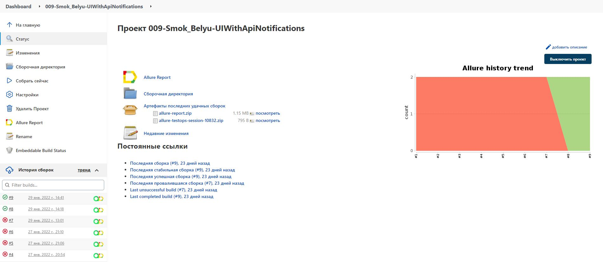
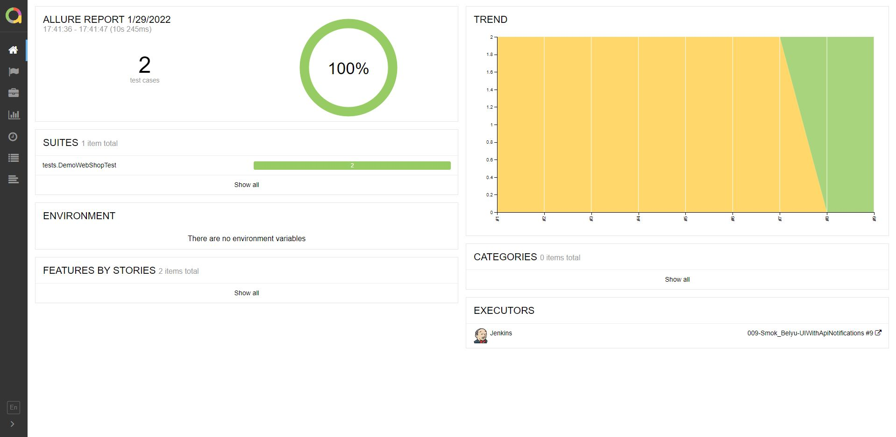
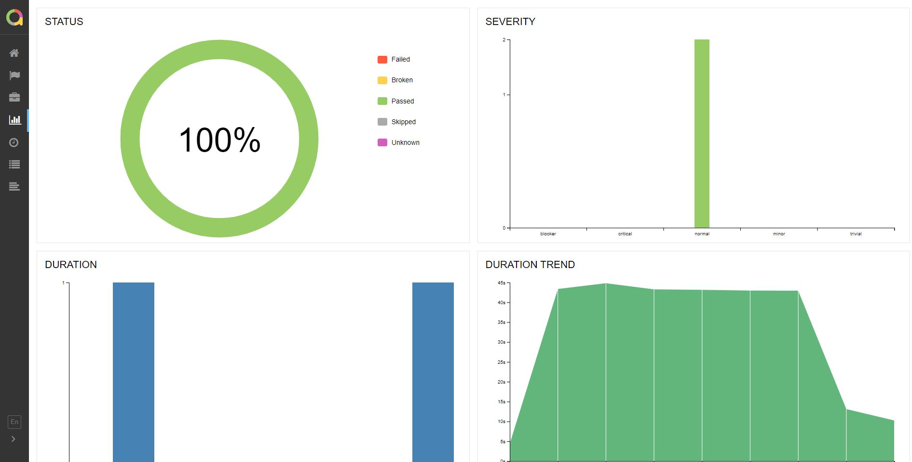
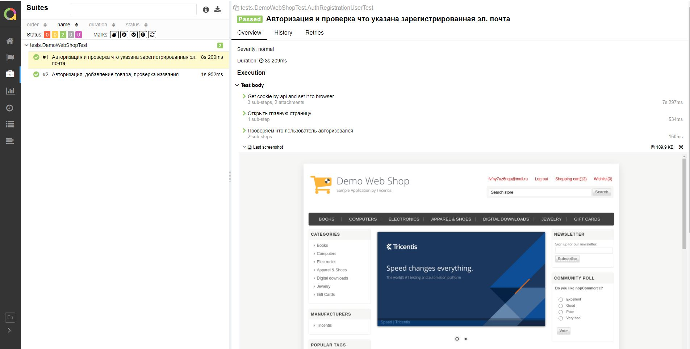
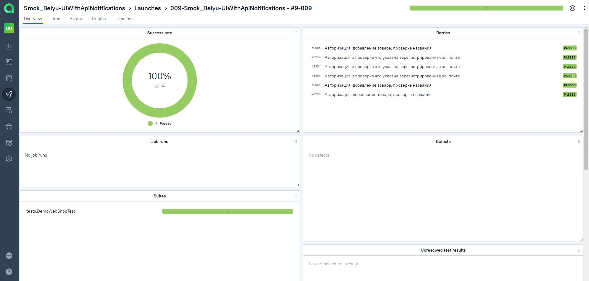
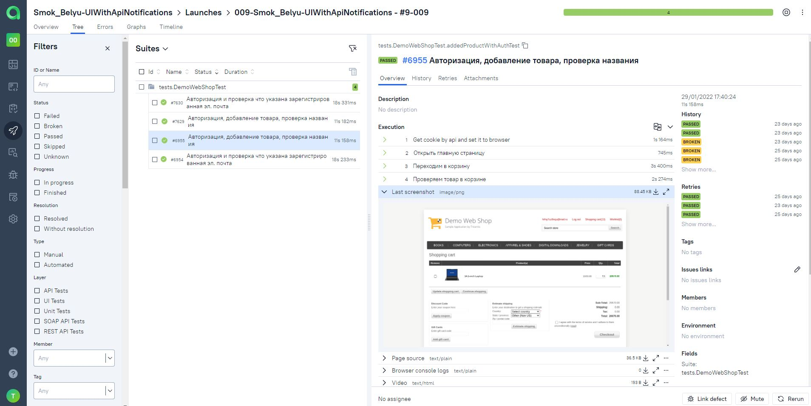

# The test automation project for API testing

___
## The project technologies:


___

## Run tests from terminal locally

### Run tests :

```bash
gradle clean test 
```

### Serve report:

```bash
allure serve build/allure-results
```

___

## Results

The test results can be found in:
+ [Jenkins](#jenkins)
+ [Allure Report](#allure-report)
+ [Allure TestOps](#allure-testOps)

### Jenkins

[Jenkins job](https://jenkins.autotests.cloud/job/009-UIWithApiNotifications/)

<p align="center">
  
</p>

### Allure Report


:arrow_right: [The launch with results](https://jenkins.autotests.cloud/job/009-UIWithApiNotifications/9/allure/)

<p align="center">
  
</p>


<p align="center">
  
</p>

:arrow_right: [The launch with results](https://jenkins.autotests.cloud/job/009-UIWithApiNotifications/9/allure/#suites/d1071dc10f3fb05fb519df702c0c447f/cd69fc4100523739/)

<p align="center">
  
</p>

### Allure TestOps

<p align="center">
  
</p>

<p align="center">
  
</p>

___

